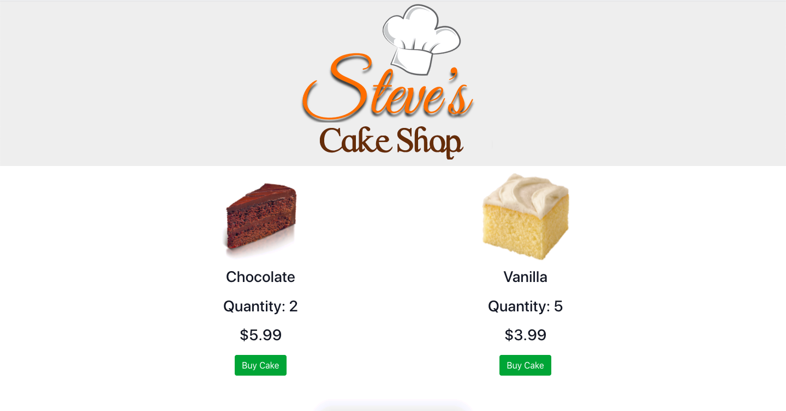

## Steve's Cake Shop 👨🏻‍🍳

We are going to build a cake shop application where we are going to use react redux library to manage the state of the application to make the app more manageable, maintainable and scalable.

The preview of the application is given below:

